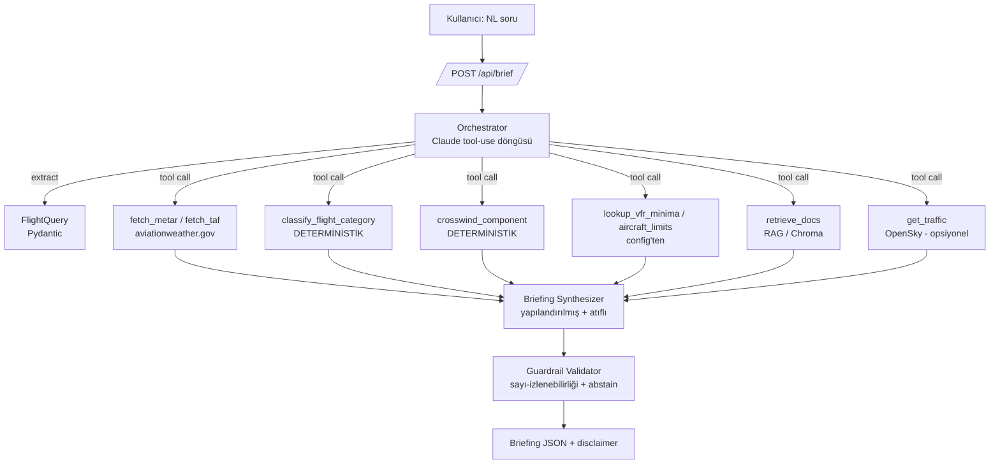

# SkyBrief — Faz 1 Teknik Tasarım

> **Amaç (Faz 1):** Kullanıcının doğal dilde sorduğu bir uçuş sorusuna, **atıflı**, **dürüst** ve
> **karar vermeyen** (advisory) bir hava/uçuş brifingi üreten **tek ajanlı** (Claude tool-calling)
> bir sistem. Güvenlik matematiği **koda** aittir; LLM yalnızca orkestrasyon + retrieval + açıklama yapar.

**Faz 1 kapsam-dışı (bilerek):** NOTAM, çok-ajanlı/LangGraph orkestrasyonu, winds-aloft, rota-boyu
(leg) hava analizi, gerçek tahmin modelleri, kimlik doğrulama. Bunlar Faz 2/3.

---

## 1. Temel tasarım ilkesi: "LLM açıklar, kod karar verir"

```
        ┌──────────── LLM'in YAPACAĞI ────────────┐   ┌──────── LLM'in ASLA YAPMAYACAĞI ───────┐
        │ • NL soruyu yapılandırılmış sorguya çevir │   │ • Eşik/limit sayısı üretmek             │
        │ • Hangi aracın çağrılacağına karar vermek │   │ • Uçuş kategorisi "hesaplamak"          │
        │ • Sonuçları atıfla açıklamak              │   │ • Crosswind/minima matematiği yapmak    │
        │ • Eksik veriyi "data gap" olarak işaretle │   │ • "Güvenli/güvenli değil" kararı vermek │
        └───────────────────────────────────────────┘   └─────────────────────────────────────────┘
```

Bu ayrım projenin kalitesini belirler: sayısal her iddia bir **deterministik araç çıktısına** kadar
izlenebilir olmalı. İzlenemeyen sayı = halüsinasyon → brifing reddedilir (bkz. §7).

---

## 2. Mimari (Faz 1)



**Katmanlar**
1. **Query Understanding** — LLM, serbest metinden `FlightQuery` çıkarır (kalkış/varış ICAO, uçak tipi, zaman, VFR/IFR).
2. **Tool layer** — veri çekme (METAR/TAF, trafik) + **deterministik** hesap araçları.
3. **Rules engine** — kategori, crosswind, minima; saf Python, test edilebilir, config-güdümlü.
4. **RAG** — regülasyon/POH metinlerinden **atıf** üretir (sayı için değil, gerekçe için).
5. **Orchestrator** — Claude tool-calling döngüsü.
6. **Synthesizer + Guardrail** — yapılandırılmış çıktı, sayı-izlenebilirliği, abstain, disclaimer.

---

## 3. Veri sözleşmeleri (Pydantic v2)

```python
class FlightQuery(BaseModel):
    departure_icao: str | None            # "LTBA"; yoksa -> data gap
    destination_icao: str | None          # "LTAC"
    aircraft_type: str = "C172"
    departure_time: datetime | None        # tz-aware; yoksa "now" varsayımı işaretlenir
    pilot_rule: Literal["VFR", "IFR"] = "VFR"
    jurisdiction: Literal["TR", "FAA", "EASA"] = "TR"   # minima seti seçimi

class WxReport(BaseModel):
    station: str
    kind: Literal["METAR", "TAF"]
    issued: datetime
    valid_from: datetime | None            # TAF için
    valid_to: datetime | None
    raw: str                               # ham rapor (atıf/şeffaflık)
    visibility_sm: float | None
    ceiling_ft: int | None
    wind_dir_deg: int | None
    wind_speed_kt: int | None
    gust_kt: int | None
    category: Literal["VFR","MVFR","IFR","LIFR"] | None   # DETERMİNİSTİK araçtan

class RiskFactor(BaseModel):
    code: str                              # "CROSSWIND_EXCEEDS_DEMO"
    severity: Literal["info","caution","warning"]
    message: str
    value: float | str | None              # araç çıktısına izlenebilir OLMALI
    source_tool: str | None                # hangi araç üretti (izlenebilirlik)
    citation: Citation | None              # RAG kaynağı (varsa)

class DataGap(BaseModel):
    field: str                             # "taf@destination", "runway_heading"
    reason: str                            # "TAF requested time window dışında"

class Citation(BaseModel):
    source: str                            # "SHGM SERA.5001" / "C172 POH s.2-13"
    page: int | None
    snippet: str

class Briefing(BaseModel):
    query: FlightQuery
    generated_at: datetime
    overall: Literal["FAVORABLE","MARGINAL","UNFAVORABLE","INSUFFICIENT_DATA"]
    weather: list[WxReport]
    risk_factors: list[RiskFactor]
    data_gaps: list[DataGap]
    citations: list[Citation]
    disclaimer: str                        # her zaman dolu (§7)
```

`overall` bir **karar değil**, risk faktörlerinin özet etiketi. Kritik veri eksikse → daima
`INSUFFICIENT_DATA` (asla tahmin ile doldurma).

---

## 4. Araç kümesi (Claude tool-use şemaları)

| Araç | Tip | Girdi → Çıktı | Kaynak |
|------|-----|---------------|--------|
| `fetch_metar(icao)` | veri | ICAO → ham+decoded METAR | aviationweather.gov `/api/data/metar?ids=&format=json` |
| `fetch_taf(icao)` | veri | ICAO → TAF (valid window) | `/api/data/taf?ids=&format=json` |
| `classify_flight_category(ceiling_ft, visibility_sm)` | **det.** | → VFR/MVFR/IFR/LIFR | §5 tablosu |
| `crosswind_component(runway_hdg, wind_dir, wind_kt)` | **det.** | → headwind_kt, crosswind_kt | §5 formülü |
| `lookup_aircraft_limits(type)` | config | → max_demo_xwind, service_ceiling, fuel_reserve_min | `config/aircraft/*.yaml` |
| `lookup_vfr_minima(jurisdiction, airspace, day_night)` | config | → vis_min, cloud_clearance | `config/minima/*.yaml` |
| `retrieve_docs(query, k=4)` | RAG | → [Citation] | Chroma |
| `get_traffic(bbox)` | veri | → uçak sayısı/yoğunluk | OpenSky (mevcut kod) — opsiyonel |

> **Kural (system prompt'ta zorunlu):** Bir eşik/kategori/sayı belirtmeden önce **ilgili deterministik
> aracı çağır**. Araç `None`/eksik dönerse → `DataGap` ekle, **tahmin etme**.

---

## 5. Deterministik kurallar motoru (kalp)

**5.1 Uçuş kategorisi** (FAA standardı — jurisdiction'a göre config'lenebilir):

| Kategori | Tavan (ceiling) | Görüş (visibility) |
|----------|-----------------|--------------------|
| VFR | > 3000 ft | ve > 5 sm |
| MVFR | 1000–3000 ft | veya 3–5 sm |
| IFR | 500–<1000 ft | veya 1–<3 sm |
| LIFR | < 500 ft | veya < 1 sm |

> ⚠️ Not: ICAO/SERA (TR/EASA) minimaları FAA'dan farklıdır. **Senin domain bilgin burada devreye girer** —
> `config/minima/TR.yaml`'ı doğru SERA değerleriyle sen doldur. Kod kategoriyi config'ten okur.

**5.2 Crosswind bileşeni** (saf trigonometri, test edilebilir):

```
angle = |wind_dir − runway_heading|   (0–180'e normalize)
crosswind_kt = wind_speed × sin(angle)
headwind_kt  = wind_speed × cos(angle)
exceeds_demo = crosswind_kt > aircraft.max_demo_xwind   # C172: 15 kt
```

**5.3 Aircraft config örneği** (`config/aircraft/C172.yaml`):
```yaml
type: "Cessna 172S"
max_demonstrated_crosswind_kt: 15
service_ceiling_ft: 14000
vfr_fuel_reserve_min: 30      # gündüz VFR (dakika)
```

**5.4 (Opsiyonel) Density altitude** — POH performansı için deterministik:
`DA = pressure_alt + 120 × (OAT − ISA_temp)`. Faz 1'de "nice-to-have".

Bu motorun tamamı **LLM'siz** ve `pytest` ile birim-test edilir. Halüsinasyon riski sıfır.

---

## 6. Orchestrator (Claude tool-calling döngüsü)

- **Model:** varsayılan `claude-sonnet-5` (orkestrasyon + sentez). Ucuz sınıflandırma alt-adımları için
  `claude-haiku-4-5`. (Güncel model/pricing için `claude-api` referansına bak.)
- **Akış:** system prompt → kullanıcı sorusu → LLM `FlightQuery` çıkarır → gereken araçları çağırır
  (paralel çağrı destekli) → araç sonuçları toplanır → LLM `Briefing`'i **yapılandırılmış çıktı** olarak üretir.
- **Sıcaklık:** düşük (0–0.2). Determinizm önemli.
- **System prompt ilkeleri:**
  1. Sen bir uçuş **brifing asistanısın**, karar mercii değilsin.
  2. Her sayısal iddia bir araç çıktısına dayanmalı; dayanmıyorsa söyleme.
  3. Eksik/çelişkili veri → `data_gaps`'e yaz, `INSUFFICIENT_DATA`'ya çek.
  4. Her regülasyon/limit iddiasına `retrieve_docs` ile atıf ekle.
  5. Çıktının sonunda daima disclaimer.

---

## 7. Halüsinasyon guardrail'leri (dürüstlük katmanı)

1. **Zorunlu yapılandırılmış çıktı** — `Briefing` şeması tool/JSON-schema ile dayatılır (serbest metin yok).
2. **Sayı-izlenebilirliği (post-validation):** Sentez sonrası kod, her `RiskFactor.value`'nun bir araç
   çıktısında gerçekten bulunduğunu doğrular. Bulamazsa → o faktör düşürülür + `data_gap` eklenir.
3. **Kodlanmış abstain:** kategori hesaplanamıyorsa / kalkış-varış ICAO yoksa / TAF istenen zaman
   penceresini kapsamıyorsa → `overall = INSUFFICIENT_DATA`. LLM'in "iyimserliğine" bırakılmaz.
4. **Disclaimer enjeksiyonu** — kod tarafından eklenir, LLM'e bırakılmaz.
5. **Ham rapor saklama** — her METAR/TAF'ın `raw`'ı çıktıda; kullanıcı kaynağı görebilir.

---

## 8. RAG tasarımı (Faz 1: küçük ama gerçek)

- **Korpus (curated):** VFR minima regülasyon metni (SERA/FAA), C172 POH alıntıları (crosswind, yakıt,
  tavan). **Telifli POH repoya konmaz** — yerelde tutulur, `.gitignore`'da.
- **Rol ayrımı:** Sayılar §5 config'inden gelir (matematik için); RAG **sadece atıf/gerekçe metni** verir.
- **Chunking:** bölüm bazlı, ~300–500 token, metadata `{source, page, jurisdiction}`.
- **Embedding:** yerel `sentence-transformers/all-MiniLM-L6-v2` (ücretsiz, offline).
- **Store:** Chroma (gömülü, sıfır-kurulum). Qdrant Faz 2'ye.

---

## 9. API (FastAPI)

```
POST /api/brief    body: {"query": "yarın 15:00 LTBA'dan LTAC'a C172 VFR"}  -> Briefing JSON
GET  /api/health   -> {"status":"ok"}
```
Frontend Faz 1'de minimal: mevcut flight-tracker haritasının yanına bir "brifing paneli" (soru kutusu +
atıflı sonuç kartı). Trafik katmanı zaten OpenSky'dan geliyor.

---

## 10. Değerlendirme (eval) — olgunluk sinyali

`data/eval/questions.jsonl` — 25 gerçek soru, ground-truth ile:
```json
{"id":"q07","question":"...","expects_abstain":true,"expected_category":null,"must_cite":true,
 "notes":"Varış için TAF istenen saati kapsamıyor -> INSUFFICIENT_DATA beklenir"}
```
**Metrikler** (`eval/run.py` → tablo):
- **Abstain doğruluğu** (precision/recall) — abstain gerektiğinde ediyor mu?
- **Kategori doğruluğu** — ground-truth METAR'a karşı.
- **Atıf kapsamı** — regülasyon iddialarının % kaçı kaynaklı.
- **Fabrication oranı** — izlenemeyen sayısal iddia sayısı (hedef: 0).
- **Gecikme + token maliyeti** — istek başına.

Test setine bilerek tuzak sorular koy (eksik veri, bilinmeyen havaalanı, aşırı crosswind) → abstain'i ölçersin.

---

## 11. Teknoloji yığını

| Katman | Seçim | Neden |
|--------|-------|-------|
| Dil/API | Python 3.11+, FastAPI, httpx, Pydantic v2 | mevcut flight-tracker ile aynı |
| LLM | Anthropic SDK, `claude-sonnet-5` (+ `haiku`) | tool-use + yapılandırılmış çıktı |
| RAG | chromadb + sentence-transformers | ücretsiz, offline, basit |
| Test | pytest (rules engine + eval) | deterministik çekirdeği kanıtla |
| Paketleme | Docker (Faz 3'te tamam, şimdi iskele) | deploy + "production" sinyali |

---

## 12. Proje yapısı (öneri)

```
skybrief/
├── backend/
│   ├── main.py                # FastAPI
│   ├── orchestrator.py        # Claude tool-use döngüsü
│   ├── synthesizer.py         # Briefing + guardrail
│   ├── models.py              # Pydantic sözleşmeleri
│   ├── tools/
│   │   ├── weather.py         # aviationweather.gov (METAR/TAF)
│   │   ├── rules.py           # DETERMİNİSTİK: kategori, crosswind
│   │   ├── config_lookup.py   # minima / aircraft yaml okuma
│   │   ├── docs_rag.py        # Chroma retrieve
│   │   └── traffic.py         # OpenSky (mevcut koddan)
│   └── config/
│       ├── minima/TR.yaml · FAA.yaml
│       └── aircraft/C172.yaml
├── rag/corpus/                # regülasyon metni (POH .gitignore)
├── data/eval/questions.jsonl
├── eval/run.py
├── frontend/                  # brifing paneli (flight-tracker'a eklenti)
├── tests/                     # pytest: rules engine
├── requirements.txt · Dockerfile · README.md
```

---

## 13. Başarısızlık modları (README'ye de gidecek)

- **METAR/TAF gecikmesi/eksikliği** → data gap, abstain.
- **TAF zaman penceresi ≠ istenen saat** → abstain (en sık tuzak).
- **ICAO ↔ SERA minima farkı** → jurisdiction config yanlışsa kategori yanılır (test şart).
- **Pist yönü bilinmiyor** → crosswind hesaplanamaz → data gap.
- **LLM iyimserliği** → guardrail §7.2/§7.3 ile bastırılır.

---

## 14. 2 haftalık plan (Faz 1)

**Hafta 1 — deterministik çekirdek + veri**
- G1–2: `FlightQuery` çıkarımı + aviationweather.gov istemcisi (METAR/TAF) + Pydantic modeller.
- G3–4: Rules engine (kategori, crosswind, minima/aircraft config) + **pytest birim testleri**.
- G5: Claude tool-use döngüsü, araçların bağlanması.

**Hafta 2 — sentez + dürüstlük + demo**
- G6–7: Synthesizer + abstain + guardrail validasyonu.
- G8: Minimal RAG (Chroma + curated korpus + atıflar).
- G9: FastAPI `/api/brief` + brifing paneli (flight-tracker'a).
- G10: 25 soruluk eval seti + metrikler + README "known gaps / failure modes".

**Faz 1 çıktısı:** tek ajanlı, atıflı, abstain edebilen, eval'li, çalışan bir demo. Faz 2 (LangGraph
multi-agent + NOTAM/PDF RAG) bunun üstüne oturur.

---

## 15. Çözülmesi gereken açık varsayımlar (senin kararın)

1. **Minima jurisdiction'ı:** Faz 1 TR/SERA mı, FAA mı? (Config değerlerini sen doğrula.)
2. **Zaman/tz:** "yarın öğleden sonra" → hangi tz, hangi TAF penceresi? Kural belirle.
3. **Rota:** Faz 1 sadece kalkış+varış mı, yoksa ara noktalar da mı? (Öneri: sadece dep+dest.)
```
