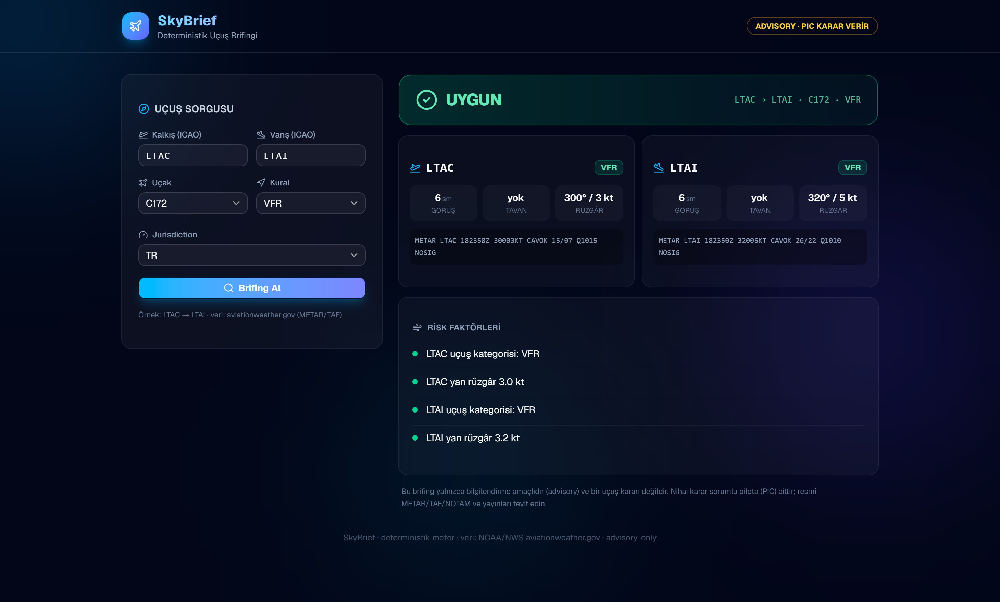
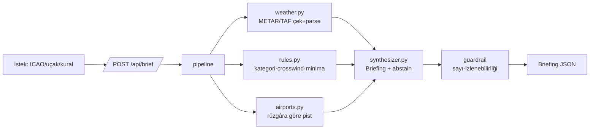

# 🛩️ SkyBrief — Deterministic Flight Briefing Engine

[](LICENSE)


Bir uçuş için **kalkış/varış hava koşullarını, VFR minimalarını ve yan rüzgârı**
değerlendirip **dürüst, atıflı, karar-vermeyen (advisory)** bir uçuş brifingi üreten
deterministik bir motor + API.

> **Tasarım ilkesi: "Kod karar verir."** Tüm güvenlik matematiği (uçuş kategorisi,
> crosswind, minima) saf, test edilebilir Python'dadır — dış yapay zeka / LLM yoktur.
> Sistem, verisi yetersizse **kesin bir cevap uydurmaz; dürüstçe "yetersiz veri" der.**

**Durum:** ✅ 75 birim testi · ✅ 25/25 eval senaryosu · ✅ abstain precision/recall %100 · ✅ 0 fabrication · ✅ canlı deploy

🔗 **Canlı demo:** <https://skybrief.onrender.com>  ·  💻 **Kod:** <https://github.com/ErenAksu17/skybrief>
> ⏳ Render ücretsiz plan: inaktiviteden sonra ilk açılış ~50 sn sürebilir (uyandırma).


*Canlı brifing (LTAC → LTAI, C172 VFR): deterministik değerlendirme + kaynak METAR + dürüst risk faktörleri.*

---

## 🇬🇧 English (summary)
A deterministic flight-briefing engine + FastAPI service. It fetches METAR/TAF
(aviationweather.gov, free), classifies flight category (VFR/MVFR/IFR/LIFR), evaluates
VFR minima, and computes crosswind against POH limits — then returns a structured,
citation-tagged, **advisory-only** briefing that abstains ("INSUFFICIENT_DATA") when
data is missing. No external AI/LLM: all safety logic is pure, unit-tested Python.
See the Turkish sections below for full docs.

---

## Ne yapar
1. **Girdi:** kalkış/varış ICAO, uçak tipi, VFR/IFR, (ops.) zaman.
2. **Veri:** METAR (mevcut) veya gelecekteki zaman için TAF dönemi — yoksa abstain.
3. **Değerlendirme (deterministik):**
   - Uçuş kategorisi: VFR / MVFR / IFR / LIFR
   - VFR minima uygunluğu (jurisdiction'a göre config)
   - Rüzgâra göre **aktif pisti otomatik seç** → yan rüzgâr → POH limiti karşılaştırması
4. **Çıktı:** risk faktörleri + data gap'ler + genel etiket
   (`FAVORABLE / MARGINAL / UNFAVORABLE / INSUFFICIENT_DATA`) + disclaimer.

## Özellikler
- 🎯 **Deterministik & test edilebilir** — güvenlik kararları koda ait, LLM yok.
- 🛑 **Dürüst abstain** — eksik ICAO/METAR, bilinmeyen görüş, TAF penceresi dışı → `INSUFFICIENT_DATA`.
- 🛬 **Otomatik pist seçimi** — havaalanı DB'sinden rüzgâra en uygun pisti seçer, o pist için crosswind hesaplar.
- 🛡️ **Guardrail** — her sayısal iddia bir araç çıktısına izlenebilir olmalı (`validate_no_fabrication`).
- 🌍 **Ücretsiz veri** — aviationweather.gov (anahtar gerekmez).
- 📊 **Eval seti** — 25 sabit senaryo + metrik harness (CI kapısı).
- 🎨 **Modern arayüz** — React + Vite + Tailwind + shadcn/ui (renkli havacılık koyu teması).

## Mimari


## API kullanımı
```bash
# Yapılandırılmış
curl -X POST localhost:8000/api/brief -H "Content-Type: application/json" \
  -d '{"departure_icao":"LTAC","destination_icao":"LTAI","aircraft_type":"C172","pilot_rule":"VFR"}'

# Serbest metin (naive parser; ICAO'lar BÜYÜK harf)
curl -X POST localhost:8000/api/brief -H "Content-Type: application/json" \
  -d '{"query":"LTAC LTAI C172 VFR"}'
```

## Kurulum & çalıştırma
```bash
python -m venv .venv && .venv\Scripts\activate     # Windows
pip install -r requirements.txt
uvicorn backend.main:app --reload                  # http://localhost:8000
pytest -q                                          # 75 test
python -m evaluation.run                           # eval tablosu
```

## Değerlendirme (evaluation)
`data/eval/questions.jsonl` içindeki 25 sabit senaryo deterministik pipeline'dan geçirilir:

| Metrik | Sonuç |
|---|---|
| Overall doğruluğu | **25/25 (100%)** |
| Abstain precision / recall | **100% / 100%** |
| Fabrication (izlenemeyen sayı) | **0** |

Senaryolar tüm karar matrisini + abstain tuzaklarını (eksik veri, pencere-dışı, bilinmeyen kategori) kapsar.

## Proje yapısı
```
SkyBrief/
├── backend/
│   ├── main.py          # FastAPI: /api/brief, /api/health
│   ├── pipeline.py      # orkestrasyon (config-first, METAR/TAF, pist çözümü)
│   ├── synthesizer.py   # Briefing üretimi + guardrail
│   ├── query_parser.py  # naive deterministik ayrıştırıcı
│   ├── models.py        # Pydantic sözleşmeleri
│   ├── tools/
│   │   ├── weather.py · rules.py · airports.py · config_lookup.py
│   └── config/          # aircraft/*.yaml · minima/*.yaml · airports.yaml
├── evaluation/run.py    # eval harness
├── data/eval/questions.jsonl
├── frontend/            # brifing paneli (index.html · style.css · app.js)
├── Dockerfile · render.yaml
└── tests/               # 75 pytest
```

## Deploy (Docker + Render)
**Yerel Docker:**
```bash
docker build -t skybrief .
docker run -p 8000:8000 skybrief      # http://localhost:8000
```

**Render (ücretsiz, tek tıkla):**
1. Kodu GitHub'a push et.
2. render.com → **New → Blueprint** → repoyu seç (`render.yaml` Docker'ı otomatik okur).
3. Deploy bitince canlı URL hazır. Backend frontend'i de servis eder (tek servis).
4. Free tier inaktivitede uyur → [cron-job.org](https://cron-job.org) ile `https://<url>/api/health`'i 5 dk'da bir ping'le.

## Bilinen sınırlar (dürüstlük bölümü)
- **Doğal dil zaman ayrıştırma yok** — "yarın öğleden sonra" desteklenmez; zaman yapılandırılmış alanla verilir. (Bilinçli tasarım: NL, kapsam-dışı LLM'in işiydi.)
- **SERA minima değerleri (TR.yaml) placeholder** — kesin değerler AIP'den doğrulanmalı.
- **NOTAM yok** — ücretsiz/güvenilir programatik NOTAM erişimi yok; kapsam-dışı.
- **ETA hesaplanmaz** — varış TAF'ı için kalkış zamanı referans alınır.
- **Görüş 9999m** aviationweather'da `6+` gelir → 6.0 sm (muhafazakâr).

## Yol haritası (deterministik)
- [x] Frontend brifing paneli (form + sonuç kartı)
- [x] Docker + Render deploy hazırlığı
- [ ] Density altitude / performans hesabı
- [ ] Regülasyon atıf araması (yerel TF-IDF, LLM'siz)
- [ ] Havaalanı DB'sini OurAirports ile genişletme

---
_Veri: OpenSky yok; aviationweather.gov (NOAA/NWS). Advisory-only — nihai karar PIC'e aittir._

## 📄 Lisans

[MIT](LICENSE) — © 2026 Eren AKSU. Kullanabilir, değiştirebilir ve dağıtabilirsiniz;
telif bildirimini koruyun. Yazılım "olduğu gibi" sunulur ve **advisory-only**'dir:
uçuş güvenliğine dair nihai karar sorumlu pilota (PIC) aittir.
